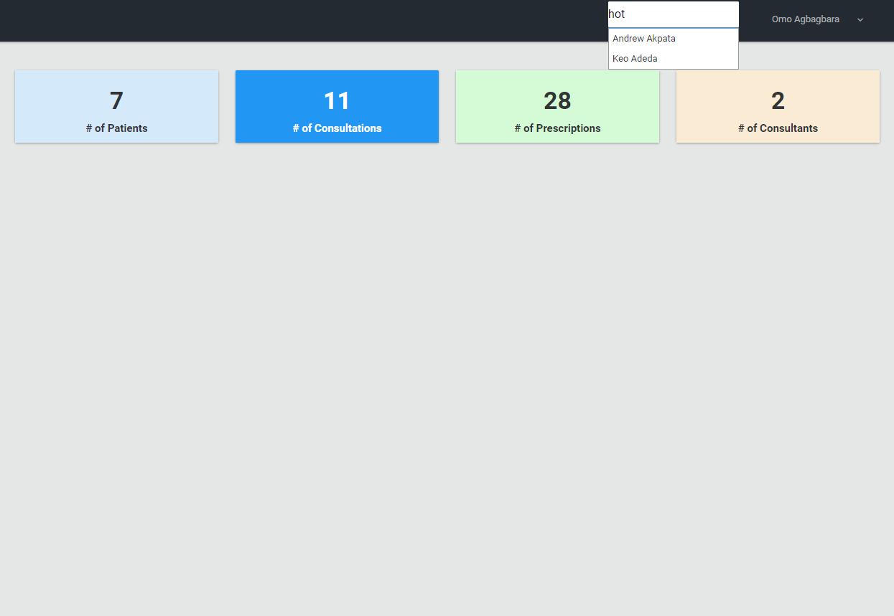
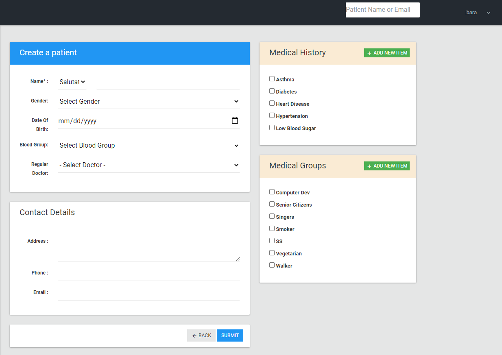
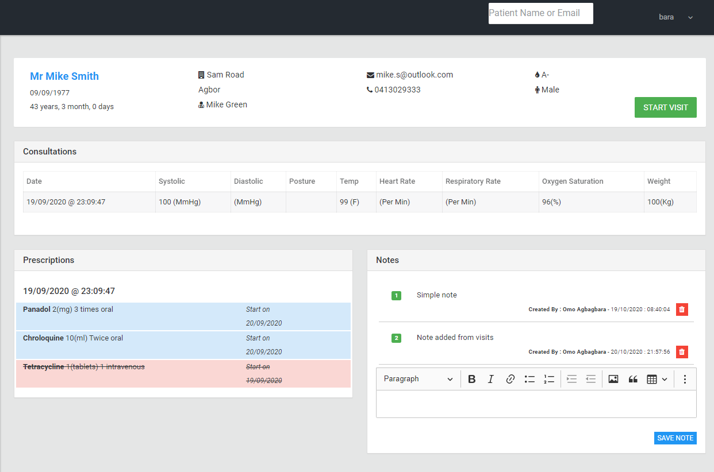
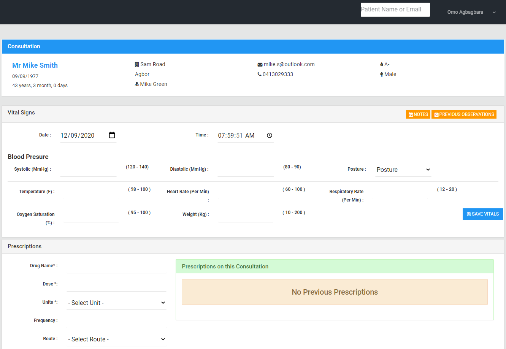
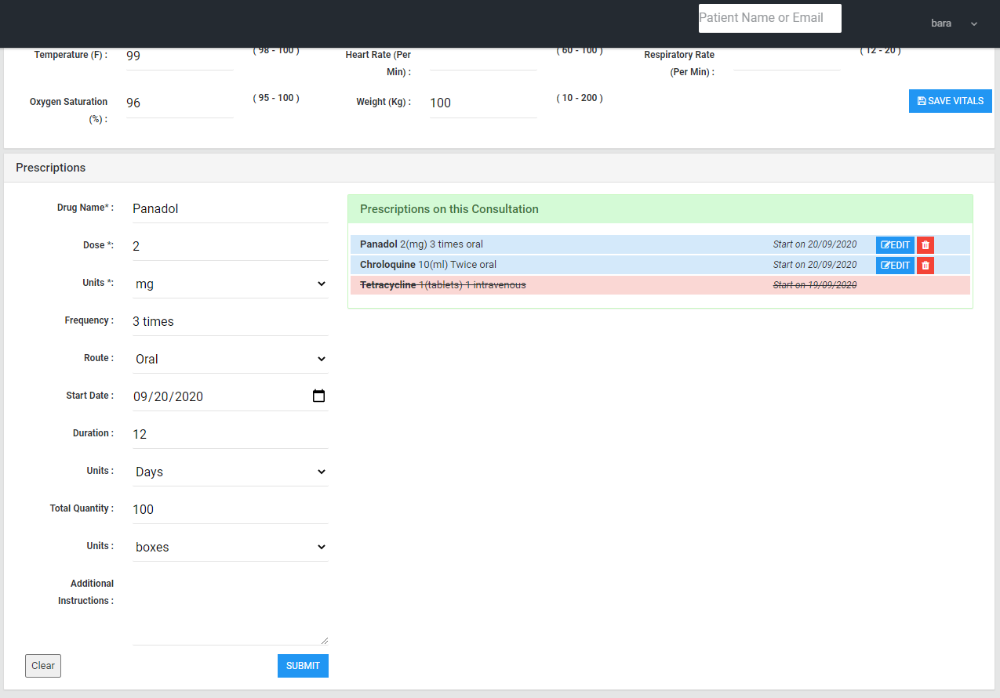

# Showcase for Konsult
Konsult is a simple web application implemented in laravel which can be used to track patients information for small pharmacists.

## Features
- Quick overview of application.
- Search for existing patients by name or email
- view a list of recently seen patients.
- Register new patients
- Start consultation\visit
- Take observations during a consultation\visit, including
1. Blood pressure
2. Temperature
3. Heart Rate
4. Respiratory Rate
5. Weight and Height.
- Add general notes about patient or visit

### Quick overview of application

### Register new patients

### Patient Overview

### Consultation Overview

### Capture Prescription
